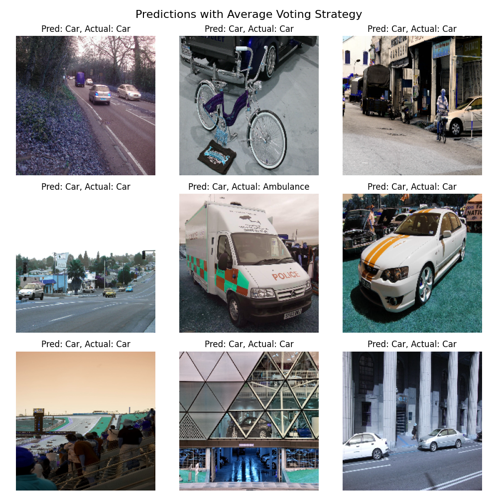
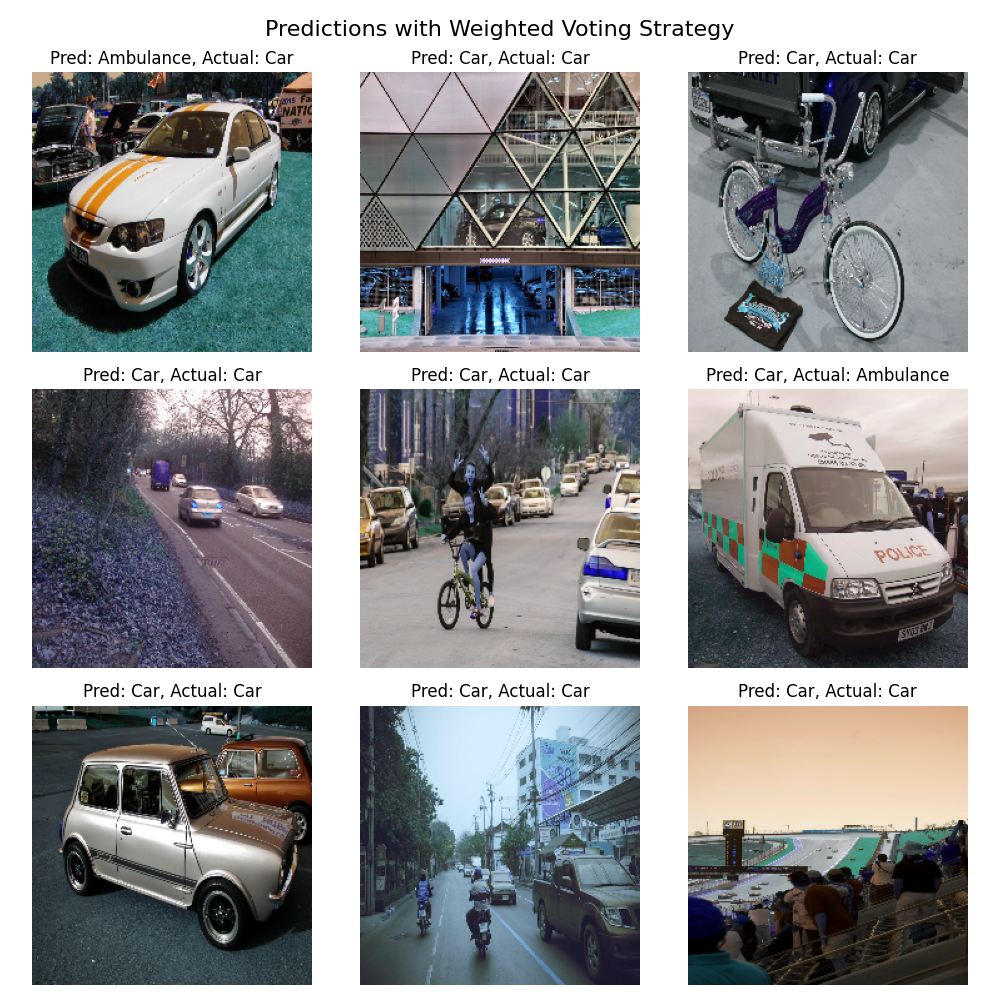

# car_vs_ambulance_classification_ensemble_cnn

# Project Overview
====================

This project aims to develop a deep learning model for image classification using Convolutional Neural Networks (CNNs). The project is designed to be modular and extensible, allowing for easy addition or removal of new models in the future.

Here’s a bullet-point description of the dataset:

### About Dataset
**Source of the Dataset** : [image-classification-and-yolo-dataset](https://www.kaggle.com/datasets/amansingh0000000/image-classification-and-yolo-dataset/data) \
**Classes**: Contains images of two primary classes: cars and ambulances. \
**Diversity**: Images include various angles, lighting conditions, and backgrounds.  \
**Labeling**: Each image is labeled for accurate classification and detection. \

**Applications**: \
**Image classification**: Identifying whether an image contains a car or an ambulance. \
**Object detection**: Locating and recognizing cars and ambulances within images. \
**Use Cases**: Ideal for projects such as traffic monitoring, emergency vehicle detection, and automated vehicle recognition systems. \
               Train file is for different types of Cars and Ambulances images. \
               Label file for the labels,which show the labels regarding about the images. 

## Planning
------------

### Steps

* **Data Preparation**: Downloading, augmenting, and storing the dataset
* **Model Development**: Creating three CNN models using the Template pattern to enable easy addition or removal of new models
* **Hyperparameter Tuning**: Training and tuning the models using Keras Tuner and storing the optimized models in the `model` directory
* **Model Evaluation**: Evaluating the performance of the trained models

## Getting Started
-------------------

### Setup

1. **Install VS Code**: Download and install Visual Studio Code from the official website.
2. **Install Dev Containers**: Install the Dev Containers extension (ms-vscode-remote.remote-containers) and the Python extension (ms-python.autopep8).
3. **Open Container**: Press `Ctrl + P` and type `open container`. This will pull the official TensorFlow Docker image from Nvidia and set up the project by installing the requirements specified in `requirements.txt`.
4. **Update Model and Hyperparameters**: Add or update the CNN model by inheriting the base model class. Update the `params.yaml` file with the desired hyperparameters for tuning (e.g., `train.fine_tune_args`).
5. **Run Experiments**: Run `dvc repro` to execute the experiments for hyperparameter tuning.

