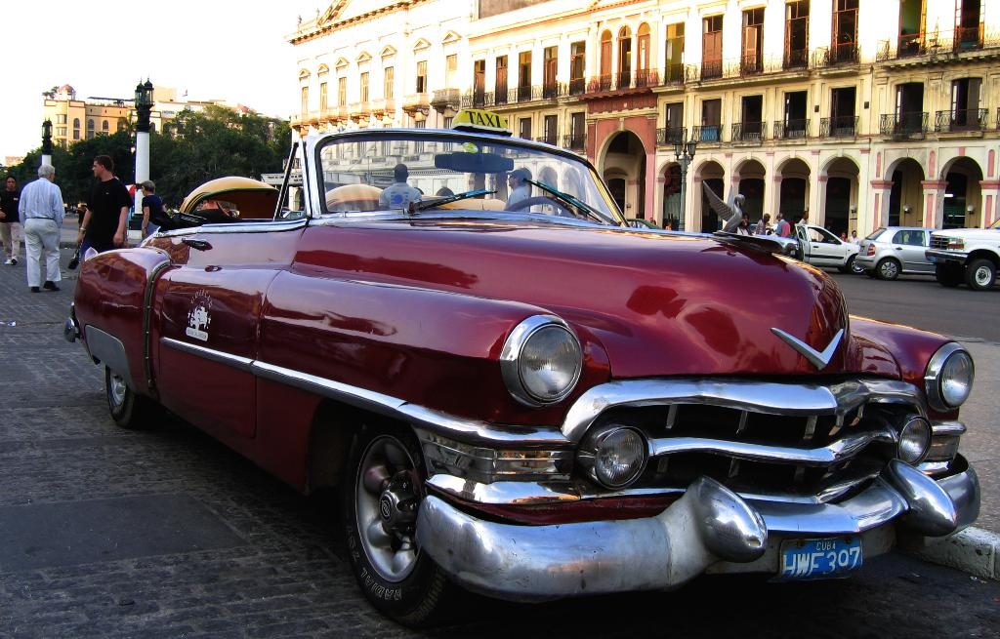

# car_vs_ambulance_classification_ensemble_cnn
I am going to use 3 different CNN models to increase accuracy for classifying car or ambulance.



Here’s a bullet-point description of the dataset:

### About Dataset
**Source of the Dataset** : [image-classification-and-yolo-dataset](https://www.kaggle.com/datasets/amansingh0000000/image-classification-and-yolo-dataset/data) \
**Classes**: Contains images of two primary classes: cars and ambulances. \
**Diversity**: Images include various angles, lighting conditions, and backgrounds.  \
**Labeling**: Each image is labeled for accurate classification and detection. \

**Applications**: \
**Image classification**: Identifying whether an image contains a car or an ambulance. \
**Object detection**: Locating and recognizing cars and ambulances within images. \
**Use Cases**: Ideal for projects such as traffic monitoring, emergency vehicle detection, and automated vehicle recognition systems. \
               Train file is for different types of Cars and Ambulances images. \
               Label file for the labels,which show the labels regarding about the images. 


## Planning
* Dataset also contain coordinates for each object in the image
* First I will try to work on only Object classification problem
* Then i will try to use those coordinates and make this problem as an Object detection

# HowTo
## Setup
1. Setup using pip
```bash
python -m venv .venv && \
. .venv/bin/activate && \
pip install --upgrade pip && \
pip install -r requirements.txt
```
2. setup using poetry
```bash
python -m venv .venv && \
. .venv/bin/activate && \
poetry install 
```
3. 